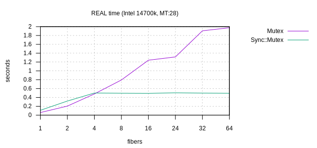
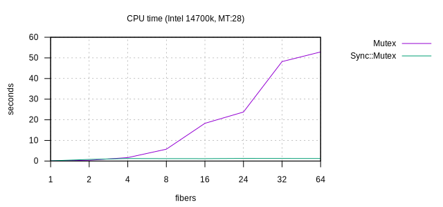

# Sync

Synchronization primitives to build concurrent-safe and parallel-safe data
structures in Crystal, so we can embrace MT with more serenity.

The provided sync primitives are meant to be useful yet low level. They can, and
should, be used to protect simple resources, but also to build higher level
constructs, for example an actor library.

The underlying implementation follows the [nsync
algorithm](https://github.com/google/nsync), that was easy to adapt from threads
to fibers. Compared to a naive atomic+spinlock mutex, the algorithm is
incredibly fast and efficient (much less wasted CPU time), and it eventually
reaches a stable value, whatever how many fibers you put, while the naive
implementation quickly goes exponential).

## Status

Experimental: in progress work to flesh out sync primitives that we may want to
have in Crystal's stdlib at some point.

## Documentation

Run `make docs` or head to
[CrystalDoc.info](https://crystaldoc.info/github/ysbaddaden/sync/).

## Primitives

- `Sync::Safe` to annotate types as (a)sync safe.
- `Sync::Lockable` to abstract the different locks (internal).

- `Sync::Mutex` to protect critical sections using mutual exclusion.
- `Sync::RWLock` to protect critical sections using shared access and mutual
  exclusion.
- `Sync::ConditionVariable` to synchronize critical sections together.

- `Sync::Exclusive(T)` to protect a value `T` using mutual exclusion.
- `Sync::Shared(T)` to protect a value `T` using a mix of shared access and
  mutual exclusion.
- `Sync::Future(T)` to delegate the computation of a value `T` to another fiber.

### TODO

- [ ] `Sync::Map(K, V)`
- [ ] `Sync::Semaphore` (?)

### Performance

While the performance of `Mutex` in stdlib is very performant when uncontended
or with only a couple threads (MT:2), the nsync algorithm used by `Sync::Mutex`
quickly proves much more performant and efficient, it even reaches expected
performance and efficiency (whatever the number of fibers), while  `Mutex`
performance drops, and efficiency plummets (high CPU time).

Here are the results of running `bench/mutex.cr` in a multithreaded execution
context (28 threads) on an Intel 14700K.

## License

Distributed under the Apache-2.0 license. Use at your own risk.
